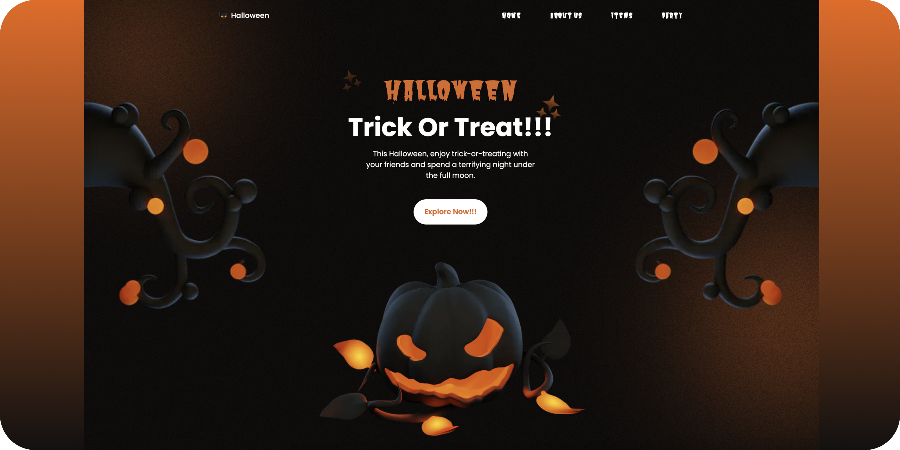

# Halloween - Trick or Treat 👻

A Halloween-themed animated landing page built with Next.js, React, TypeScript, Framer Motion, and CSS.

The project focuses on a creative seasonal UI, smooth animations, reusable components, and responsive layout.

## Technologies Used

- TypeScript
- React
- Next.js
- Framer Motion
- React Icons
- CSS
